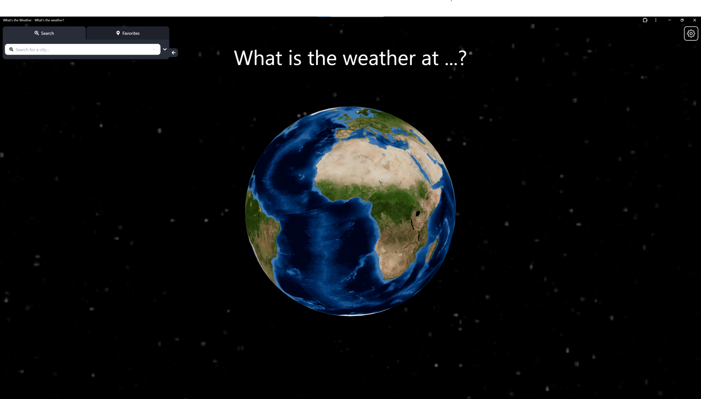
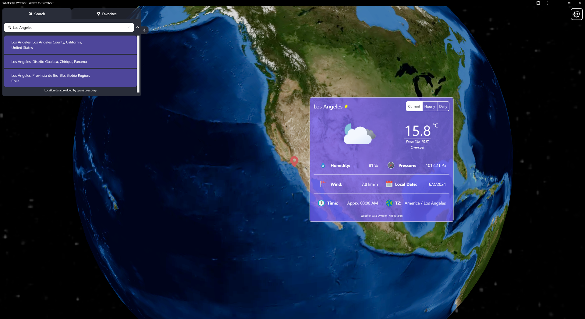
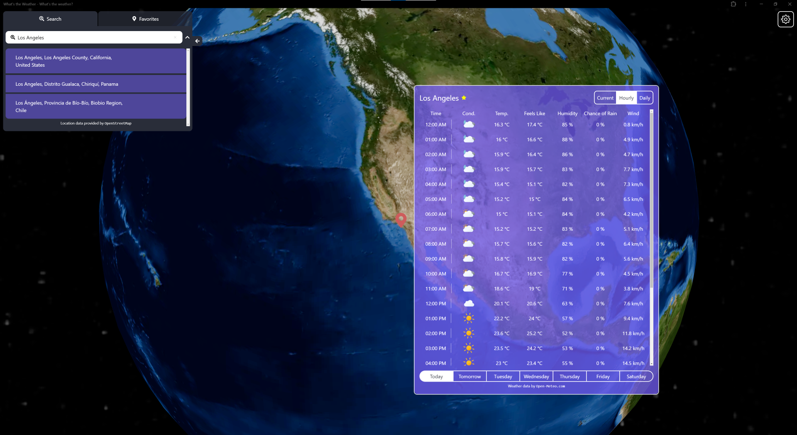
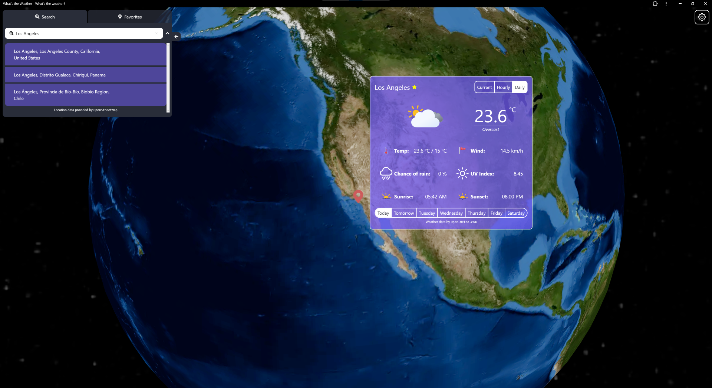
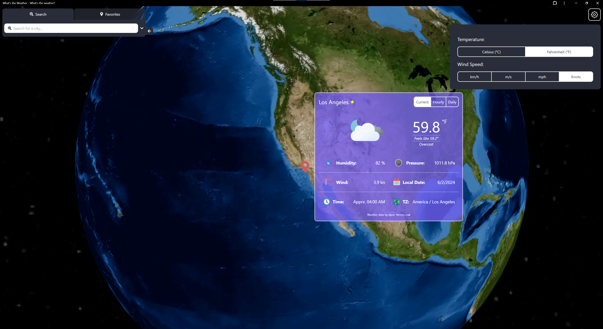

# Weather Wonder - Interactive 3D Weather Map

   

An open-source 3D progressive web application ([PWA](https://web.dev/explore/progressive-web-apps)) for checking current/hourly/daily weather forecast in any location you want on globe. Users can also save their favorite places for fast access.

Visit [Weather Wonder](https://weatherwonder.vercel.app/) to try out!

Available information for selected locations:

- **Current Weather**

  1. Temperature
  2. Apparent Temperature (aka. Feels like...)
  3. Humidity
  4. Pressure
  5. Wind Speed
  6. Local Date at the selected location
  7. Local Time at the selected location
  8. Timezone

- **Hourly Weather (24h)**

  1. Temperature
  2. Apparent Temperature (aka. Feels like...)
  3. Humidity
  4. Probability of Precipitation (Chance of Rain)
  5. Wind Speed

- **Daily Weather (7-day forecast)**

  1. Temperature (Both Highest/Lowest)
  2. Wind Speed
  3. Chance of Rain
  4. UV Index
  5. Sunrise and Sunset Time

### Screenshots

  
       
  
       
  

  
       
  
       
  

## Credits

- Location data provided by [`OpenStreetMap`](https://openstreetmap.org/copyright)
- Weather data by [`Open-Meteo.com`](https://open-meteo.com)
