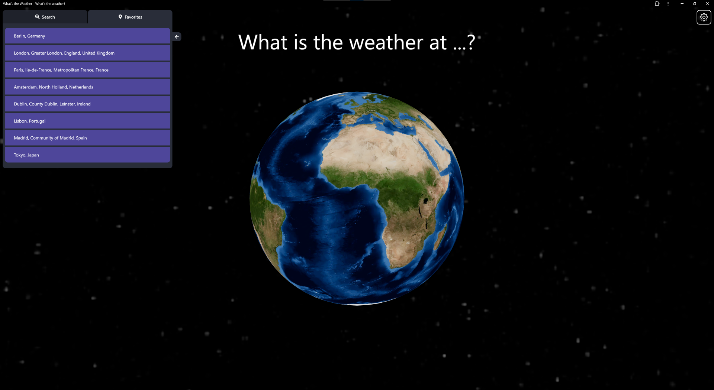

This is a 3D progressive web application  designed for checking current, hourly, and daily weather forecasts for any location on the globe. Users can also save their favorite places for quick access.

Visit (https://weatherwonder.vercel.app/)

## Features

### Available Information for Selected Locations:

#### Current Weather
- **Temperature**
- **Apparent Temperature** (Feels like...)
- **Humidity**
- **Pressure**
- **Wind Speed**
- **Local Date** at the selected location
- **Local Time** at the selected location
- **Timezone**

#### Hourly Weather (24h)
- **Temperature**
- **Apparent Temperature** (Feels like...)
- **Humidity**
- **Probability of Precipitation** (Chance of Rain)
- **Wind Speed**

#### Daily Weather (7-day forecast)
- **Temperature** (Both Highest/Lowest)
- **Wind Speed**
- **Chance of Rain**
- **UV Index**
- **Sunrise and Sunset Time**

### Screenshots

<p align="center">
  
  
  
</p>

<p align="center">
  
  
  
</p>

## How It Works

This uses data from multiple sources to provide comprehensive weather information:

- **Location Data**: Provided by [OpenStreetMap](https://openstreetmap.org/copyright), this data helps in identifying and locating places on the globe.
- **Weather Data**: Provided by [Open-Meteo.com](https://open-meteo.com), this data includes current weather, hourly forecasts, and daily forecasts for the selected locations.
- **3D Visualization**: A GLB file is used to render the 3D globe on which weather data is visualized.

## Installation

### Prerequisites

Ensure you have the following installed:

- Node.js (>=14.0.0)
- npm (>=6.0.0) or yarn (>=1.22.0)

### Steps

1. **Clone the Repository**:
    ```bash
    git clone https://github.com/yourusername/weather-wonder.git
    cd weather-wonder
    ```

2. **Install Dependencies**:
    Using npm:
    ```bash
    npm install
    ```
    Or using yarn:
    ```bash
    yarn install
    ```

3. **Run the Application**:
    Using npm:
    ```bash
    npm start
    ```
    Or using yarn:
    ```bash
    yarn start
    ```
    This will start the development server and open the application in your default browser.

## Data Sources

### Location Data
The location data is obtained from OpenStreetMap. This data is used to pinpoint locations on the 3D globe and provide context for weather data. The data is fetched using the OpenStreetMap API.

### Weather Data
The weather data is provided by Open-Meteo.com. This includes:
- Current weather conditions such as temperature, humidity, and wind speed.
- Hourly forecasts for the next 24 hours.
- Daily forecasts for the next 7 days, including high/low temperatures, wind speed, chance of rain, UV index, and sunrise/sunset times.

The data is fetched using the Open-Meteo API, which provides real-time and forecasted weather information.

### 3D Visualization
The 3D globe visualization is rendered using a GLB file. GLB (GL Transmission Format Binary) is a binary version of the GLTF (GL Transmission Format) file format. It is optimized for loading speed and used for rendering the interactive 3D globe in the application.

